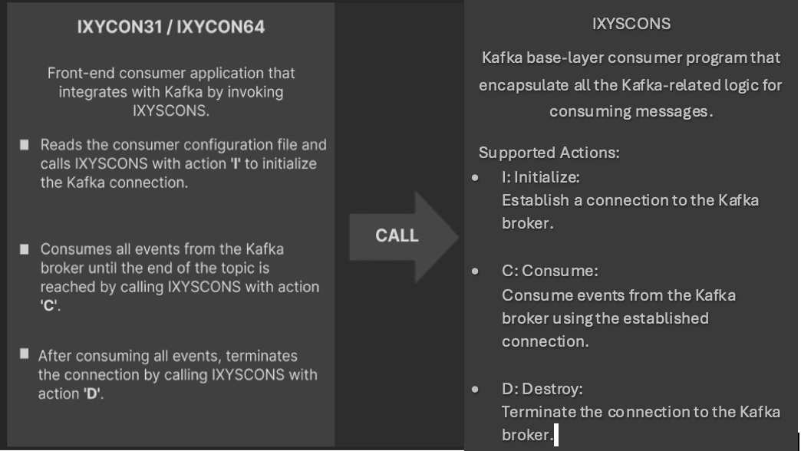

# Open-Enterprise-SDK-for-Apache-Kafka

This repository contains samples that take advantage of the Open Enterprise SDK for Apache Kafka to produce and consume Kafka events from COBOL applications.

---

## Table of Contents

1. [Create COBOL Kafka Producer Application](#1-create-cobol-kafka-producer-application)
    1. [Creating IXYSPRDS, Kafka producer base COBOL program](#11-creating-ixysprds-kafka-producer-base-cobol-program)
    2. [Creating IXYPRD64, Kafka producer application COBOL program](#12-creating-ixyprd64-kafka-producer-application-cobol-program)
    3. [Create Kafka producer configuration file](#13-create-kafka-producer-configuration-file)
    4. [Create topic configuration file](#14-create-topic-configuration-file)
    5. [Compile Kafka producer Application](#15-compile-kafka-producer-application)
    6. [Run producer application](#16-run-producer-application)
2. [Create COBOL Kafka Consumer Application](#2-create-cobol-kafka-consumer-application)
    1. [Creating IXYSCONS, Kafka consumer base COBOL program](#21-creating-ixyscons-kafka-consumer-base-cobol-program)
    2. [Creating IXYCON64, Kafka consumer application COBOL program](#22-creating-ixycon64-kafka-consumer-application-cobol-program)
    3. [Create consumer configuration file](#23-create-consumer-configuration-file)
    4. [Create topic configuration file](#24-create-topic-configuration-file)
    5. [Compile Kafka consumer application](#25-compile-kafka-consumer-application)
    6. [Run consumer application](#26-run-consumer-application)
3. [Serialization and Deserialization](#3-serialization-and-deserialization)
    1. [Data Transformation Utility](#31-data-transformation-utility)
    2. [Run Kafka producer sample with data serialization](#32-run-kafka-producer-sample-with-data-serialization)
    3. [Run Kafka consumer sample with data deserialization](#33-run-kafka-consumer-sample-with-data-deserialization)
4. [Best Practices](#4-best-practices)
5. [Getting help and troubleshooting](#5-getting-help-and-troubleshooting)

---

## 1. Create COBOL Kafka Producer Application


To efficiently manage Kafka interactions in COBOL applications, the SDK introduces a sample base program: IXYSPRDS for producing. These base programs encapsulate all underlying Kafka logic, including connection management, configuration handling, and message flow.

### 1.1 Creating IXYSPRDS, Kafka producer base COBOL program

- Open the file [`src/IXYSPRDS.cbl`](src/IXYSPRDS.cbl) in Edit mode.
- The IXYSPRDS Kafka producer base program has the following sections:
    - **Initialization (I):**
        - Create Kafka configuration object
        - Establish connection to Kafka cluster
        - Set configuration parameters
        - Set delivery callback
        - Create producer and topic objects
    - **Produce events (P):**
        - Produce messages
    - **Destroy:**
        - Clean up resources
        - Tear down the connection 

### 1.2 Creating IXYPRD64, Kafka producer application COBOL program

- Open [`src/IXYPRD64.cbl`](src/IXYPRD64.cbl) in Edit mode.
- Reads configuration from [`conf/IXYPCONF.CONFIG`](conf/IXYPCONF.CONFIG) and constructs parameter arrays.
- Calls IXYSPRDS to:
    - Initialize
    - Read event file and produce message for every line 
    - Once done with producing all the events, clean up.

### 1.3 Create Kafka producer configuration file

- Located at [`conf/IXYPCONF.CONFIG`](conf/IXYPCONF.CONFIG)
- Format: `key=value` per line (no blank lines)
- Example:
    ```
    bootstrap.servers=broker1:9093,broker2:9093
    sasl.username=token
    sasl.password=<APIKEY>
    security.protocol=SASL_SSL
    ```

### 1.4 Create topic configuration file

- Located at [`conf/IXYTCONF.CONFIG`](conf/IXYTCONF.CONFIG)
- Format: `topic-name` in a single line (no blank lines)
- Example:
    ```
    credit-account-transaction
    ```

### 1.5 Compile Kafka producer Application

- Use JCL scripts in [`jcl/`](jcl/):
    - [`jcl/IXYJPRDS.jcl`](jcl/IXYJPRDS.jcl): Compile/link base producer
    - [`jcl/IXYJPR64.jcl`](jcl/IXYJPR64.jcl): Compile/link producer application

### 1.6 Run producer application

- Use [`jcl/IXYJRP64.jcl`](jcl/IXYJRP64.jcl) to run the producer.
- Set the event file and LIBPATH as needed.
- Check SYSOUT for results.

---

## 2. Create COBOL Kafka Consumer Application



The SDK introduces a sample base program: IXYSCONS for consuming. These base programs encapsulate all underlying Kafka logic, including connection management, configuration handling, and message flow.

### 2.1 Creating IXYSCONS, Kafka consumer base COBOL program

- Open [`src/IXYSCONS.cbl`](src/IXYSCONS.cbl) in Edit mode.
- The consumer base program IXYSCONS does:
    - **Initialization (I):**
        - Create Kafka configuration object
        - Set configuration parameters
        - Create consumer and partition list
        - Subscribe to topic
    - **Consume (C):**
        - Poll and process messages
    - **Destroy (D):**
        - Clean up resources
        - Detach the connection

### 2.2 Creating IXYCON64, Kafka consumer application COBOL program

- Open [`src/IXYCON64.cbl`](src/IXYCON64.cbl) in Edit mode.
- Reads configuration from [`conf/IXYCCONF.CONFIG`](conf/IXYCCONF.CONFIG) and constructs parameter arrays.
- Calls IXYSCONS to:
    - Initialize the Kafka connection and consumer object
    - Consume a single message at a time
    - Clean up once done with consuming all the messages from topic 

### 2.3 Create consumer configuration file

- Located at [`conf/IXYCCONF.CONFIG`](conf/IXYCCONF.CONFIG)
- Format: `key=value` per line (no blank lines)
- Example:
    ```
    bootstrap.servers=broker1:9093,broker2:9093
    sasl.username=token
    sasl.password=<APIKEY>
    group.id=0
    auto.offset.reset=earliest
    ```

### 2.4 Create topic configuration file

- Located at [`conf/IXYTCONF.CONFIG`](conf/IXYTCONF.CONFIG)
- Format: `topic-name` in a single line (no blank lines)
- Example:
    ```
    credit-account-transaction
    ```

### 2.5 Compile Kafka consumer application

- Use JCL scripts in [`jcl/`](jcl/):
    - [`jcl/IXYJCONS.jcl`](jcl/IXYJCONS.jcl): Compile/link base consumer
    - [`jcl/IXYJCN64.jcl`](jcl/IXYJCN64.jcl): Compile/link consumer application

### 2.6 Run consumer application

- Use [`jcl/IXYJRC64.jcl`](jcl/IXYJRC64.jcl) to run the consumer.
- Set LIBPATH as needed.
- Check SYSOUT for consumed messages.

---

## 3. Serialization and Deserialization

### 3.1 Data Transformation Utility

The data transformation utility is included in Open Enterprise SDK for Apache Kafka to help you transform data between native COBOL copybooks and the event format in JSON/Avro. The utility is available as a command-line tool.

The utility generates COBOL copybooks and code snippets for a specific Kafka event schema. The generated copybooks can be used to process the Kafka event JSON object in COBOL applications. The utility-generated code snippets are used to transform COBOL event data byte arrays into a JSON object for a Kafka producer, and a JSON object into COBOL event data byte arrays for a Kafka consumer.

#### Example: Generating a COBOL Copybook from an Avro Schema

To use the utility, first connect to the z/OS Unix System Services (USS) environment and follow these steps:

1. **Set the `KAFKA_HOME` variable:**
    ```sh
    export KAFKA_HOME=/path/to/kafka
    ```

2. **Export the PATH environment variable:**
    ```sh
    export PATH=$PATH:$KAFKA_HOME/util
    ```

3. **Create a working directory:**
    ```sh
    mkdir ~/demo
    ```

4. **Change to the working directory:**
    ```sh
    cd ~/demo
    ```

5. **Copy the sample Avro schema:**
    ```sh
    cp dtu-samples/employee-schema.avsc employee-schema.avsc
    ```

6. **Copy the sample language properties file:**
    ```sh
    cp dtu-samples/elang.properties lang.properties
    ```

7. **Run the data transformation utility:**
    ```sh
    data-transformation-utility.sh -l lang.properties
    ```

8. **Result:**  
   The data transformation utility generates the COBOL copybook and other transformation code snippets, which can then be added to your business application.

### 3.2 Run Kafka producer sample with data serialization

- Edit and run [`src/IXYPAV64.cbl`](src/IXYPAV64.cbl) to produce Avro-serialized messages.
- Use [`conf/IXYSCONF.CONFIG`](conf/IXYSCONF.CONFIG) for SerDes configuration.
- Run with [`jcl/IXYJRPA6.jcl`](jcl/IXYJRPA6.jcl).

### 3.3 Run Kafka consumer sample with data deserialization

- Edit and run [`src/IXYCAV64.cbl`](src/IXYCAV64.cbl) to consume and deserialize Avro messages.
- Use [`conf/IXYSCONF.CONFIG`](conf/IXYSCONF.CONFIG) for SerDes configuration.
- Run with [`jcl/IXYJRCA6.jcl`](jcl/IXYJRCA6.jcl).

---

## 4. Best Practices

Let us go through some of the best practices to be followed in online and batch application.

1. **Kafka SDK for Online Applications:**  
   - Better performance with long running producer in online applications:  
     
     This architecture illustrates a pattern where a transaction Update Order writes events to a local staging area like queue, VSAM, or file, within the same Unit of Work (UOW) as the main transaction, ensuring consistency. A long running producer transaction then reads these staged events asynchronously, deletes them upon successful processing, and sends them to Kafka using the native Open Enterprise SDK for Apache Kafka. This decouples the main application logic from Kafka connectivity and allows for controlled event delivery.

   - Better performance with long running consumer in online applications:  
     
     The diagram shows a consumption pattern where a long-running Kafka consumer, built using the Open Enterprise SDK for Apache Kafka, continuously polls and receives batches of events from a Kafka topic. Upon receiving each event, the consumer initiates a transaction and routes the event to application logic, such as creating or canceling orders.

2. **Kafka SDK for Batch Applications:**  
   For z/OS batch Kafka applications, follow a structured lifecycle: perform initialization once at the beginning of the job to set up Kafka producer or consumer connections, produce or consume messages as required during processing, and finally destroy the Kafka connection at the end of the batch job. This approach ensures efficient resource usage and clean termination, as demonstrated in the above samples.

---

## 5. Getting help and troubleshooting

- Enable debug logging with `debug=all` in configuration.
- Check job logs and return codes for errors.
- Refer to IBM documentation for detailed error codes and troubleshooting steps.

---

**License**

Copyright 2025 IBM Corporation

Licensed under the Apache License, Version 2.0 (the "License"); you may not use this file except in compliance with the License. You may obtain a copy of the License at

http://www.apache.org/licenses/LICENSE-2.0

Unless required by applicable law or agreed to in writing, software distributed under the License is distributed on an "AS IS" BASIS, WITHOUT WARRANTIES OR CONDITIONS OF ANY KIND, either express or implied. See the License for the specific language governing permissions and limitations under the License.

---
